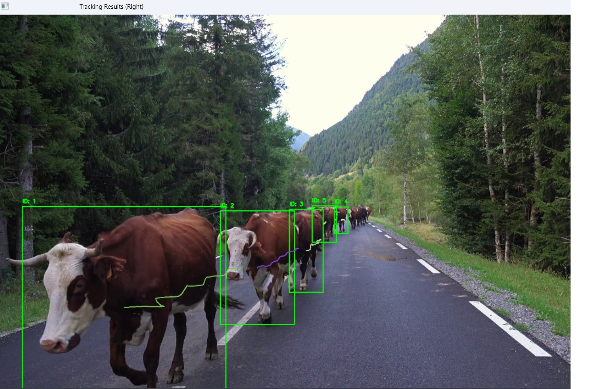

# cows-multi-tracking-YOLOv8-ByteTrack
# Cows/Animal Multi-Tracking with YOLOv8 and ByteTrack

## Demo
This demo is a simple software that I created using my studies and courses.

## Overview
This software is designed for real-time object detection and tracking in video streams, using YOLO (You Only Look Once) for detection and ByteTrack for multi-object tracking. It is suitable for tracking objects in video footage, and can run on both GPU and CPU.

**Key Features:**
- Real-time video reading and frame buffering in a dedicated thread.
- Asynchronous frame processing (detection + tracking) in a separate thread.
- Uses YOLOv8 for object detection and ByteTrack for robust multi-object tracking.
- Visualizes both detection and tracking results side-by-side.
- Supports both GPU and CPU execution.

---

## System Architecture

The system is built around two main threads:

1. **Video Reading Thread**  
   - Reads frames from a video file.
   - Stores the latest frame in a thread-safe singleton buffer.

2. **Processing Thread**  
   - Waits for new frames.
   - Runs YOLO object detection.
   - Passes detections to ByteTrack for tracking.
   - Draws detection and tracking results.
   - Combines and displays the results.

### Diagram

```
+-------------------+         +---------------------+         +---------------------+
|                   |         |                     |         |                     |
|  Video File/Camera| ---->   | Video Reading Thread| ---->   |  Frame Buffer       |
|                   |         | (camera_video.py)   |         | (frames.py)         |
+-------------------+         +---------------------+         +---------------------+
                                                                      |
                                                                      v
                                                        +--------------------------+
                                                        | Processing Thread        |
                                                        | (processador.py)        |
                                                        | - YOLO Detection        |
                                                        | - ByteTrack Tracking    |
                                                        | - Visualization         |
                                                        +--------------------------+
                                                                      |
                                                                      v
                                                        +--------------------------+
                                                        |   Display/Output         |
                                                        +--------------------------+
```

---

## Example Output

Below is an example of the software in action. The left side shows YOLO detections (blue boxes), and the right side shows ByteTrack tracking results (green boxes with IDs):



*(Replace the above link with the actual image after uploading to your repo.)*

---

## How It Works

### 1. Video Reading (`camera/camera_video.py`)
- A thread reads frames from a video file.
- Each frame is stored in a singleton buffer (`Frames` class).
- The reading thread can be stopped when the video ends or by user command.

### 2. Frame Buffer (`camera/frames.py`)
- Implements a thread-safe singleton to store and retrieve the latest frame.
- Notifies the processing thread when a new frame is available.

### 3. Processing (`core/processador.py`)
- A separate thread waits for new frames.
- Runs YOLOv8 for object detection (configurable for GPU/CPU).
- Passes detections to ByteTrack for multi-object tracking.
- Draws bounding boxes and tracking IDs.
- Combines detection and tracking results for display.

### 4. Visualization (`core/funcoes.py`)
- Draws detection boxes (blue) and tracking boxes/IDs (green).
- Shows object trajectories with colored lines.
- Combines detection and tracking images side-by-side.

---

## Running the Software

1. **Install dependencies** (Python, OpenCV, Ultralytics YOLO, ByteTrack, etc.)
2. **Place your video file** in the appropriate directory (default: `./apoio/cows3.mp4`).
3. **Run `main.py`**:
   ```
   python main.py
   ```
4. **Press `q`** to quit the visualization window.

---

## GPU/CPU Support

- The software automatically detects and uses GPU if available (see `utils.obter_cpu_gpu()`).
- Falls back to CPU if no GPU is detected.

---

## File Structure

```
camera/
  camera_video.py   # Video reading thread
  frames.py         # Frame buffer (singleton)
core/
  processador.py    # Processing thread (YOLO + ByteTrack)
  funcoes.py        # Helper functions for drawing, etc.
main.py             # Entry point
```

---

## Example Result

*(Insert the image you provided here, or reference it as shown above.)*

---

## License

MIT License
